# 웹 기반 소상공인 ERP 시스템

> 프랜차이즈 가맹점을 위한 통합형 ERP 시스템  입니다.

 ## 프로젝트 개요

### 프로젝트 주제 및 선정 배경
프랜차이즈 본사 사장의 입장에서 가맹점 관리는 쉽지 않습니다.

- 직원들은 제각각 수기로 출퇴근을 기록하고,
- 점장들은 엑셀 근무표를 카톡으로 주고받고,
- 사장은 각 지점의 매출/운영 현황을 제대로 확인할 수 없습니다.

> 이 시스템은 이러한 **3직급의 단절된 흐름을 하나의 ERP 시스템 안에서 연결**하기 위해 설계되었습니다.

---

### 현재의 문제와 이에 대한 방안

| 사용자 | 문제점 | 시스템 해결 방식 |
|--------|--------|------------------|
| **직원** | 출퇴근 수기 기록, 급여 확인 어려움 | 출퇴근 자동 기록, 실시간 급여 계산 |
| **점장** | 스케줄 관리 수작업, 직원 정보 누락 | 근무표 업로드 기능, 프로필·계약 관리 |
| **사장** | 지점별 운영 파악 어려움, 인사 통제 부족 | 지점별 통계 확인, 지점 등록/삭제, 직원 조회 |

---

### ✅ 핵심 가치

- **"직원부터 사장까지, 단절 없는 운영 관리"**
- **"지점을 보는 시스템에서, 본사를 보는 시스템으로"**
- 단순한 기능 모음이 아닌 **통합 흐름 기반 ERP 설계**

---

## 기술 스택
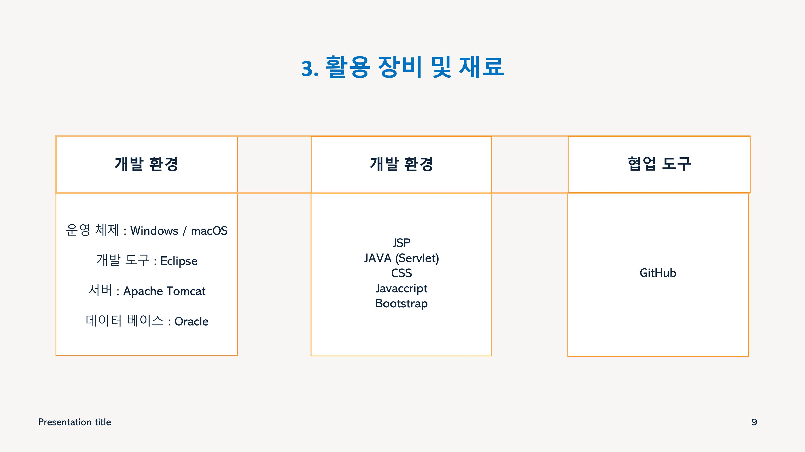

---

## 역할 분담
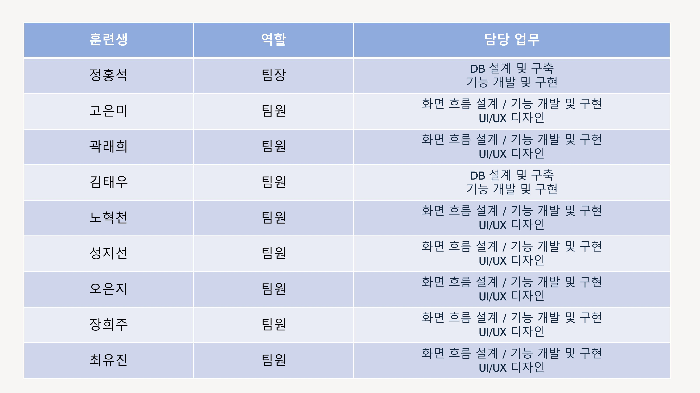

---

## 주요 화면 구현
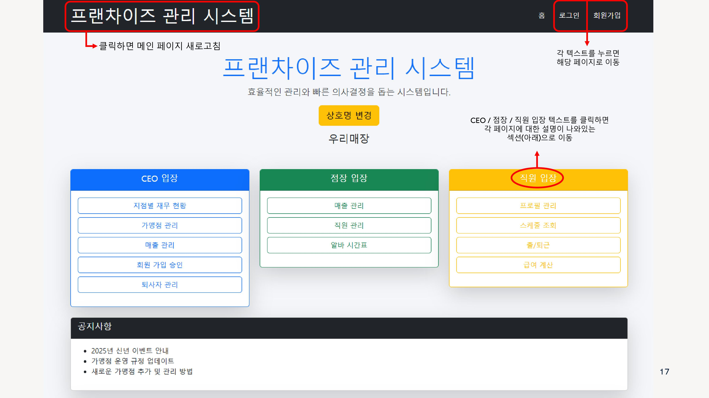

### 회원가입
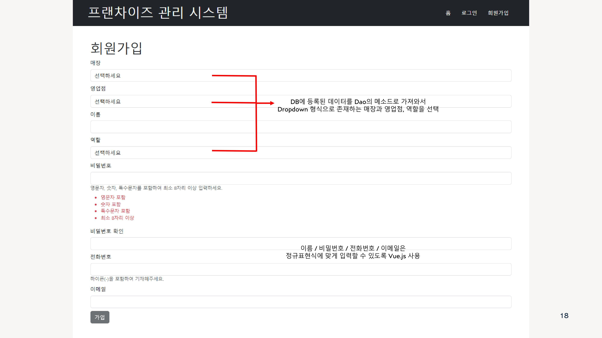

### 로그인 페이지
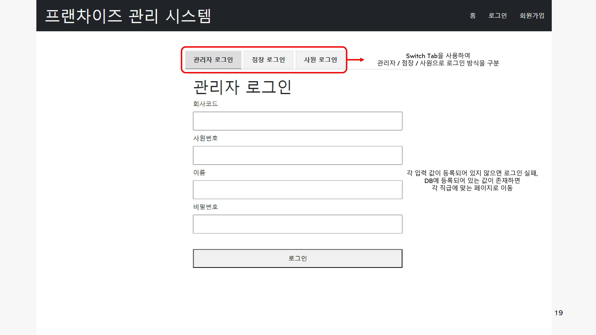

### 개발자 전용 페이지
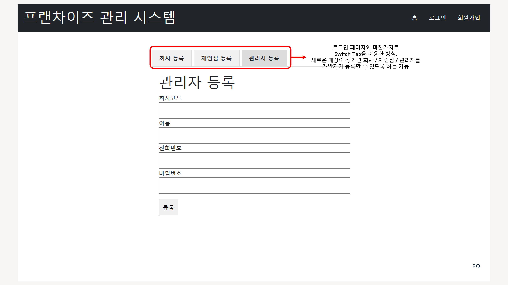

---

### CEO 페이지
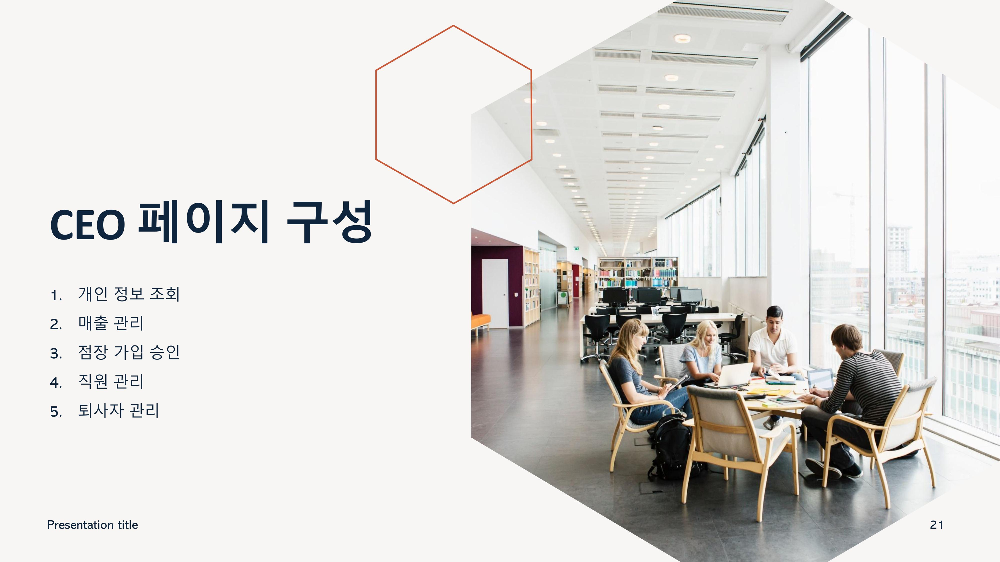
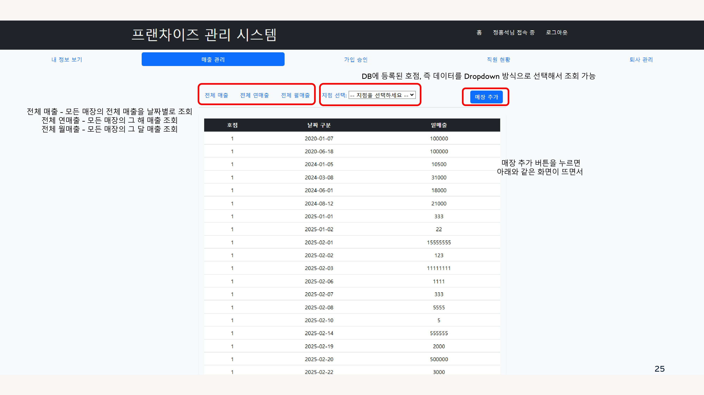

---

### 점장 페이지
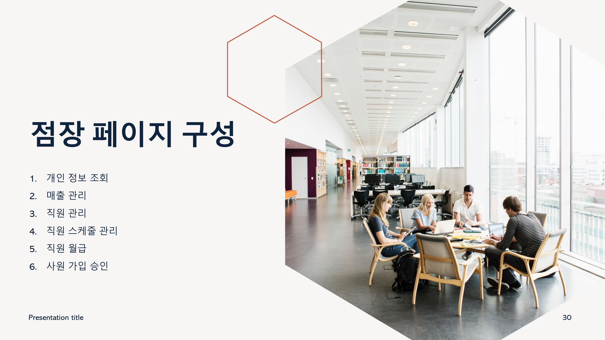
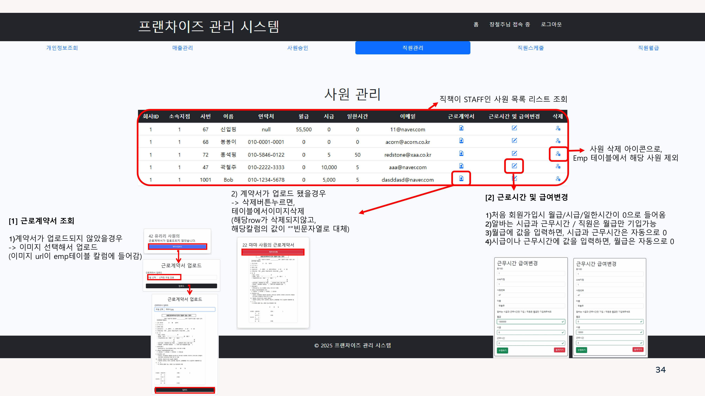

---

### 직원 페이지

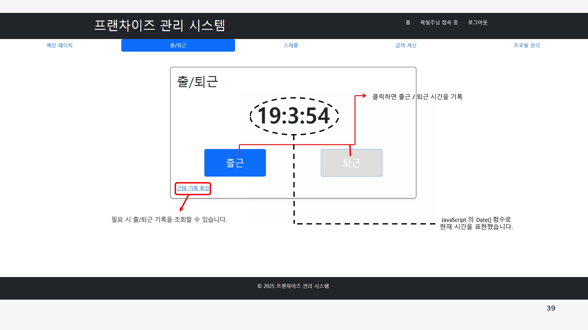

---

### 공지 사항

## 🧠 개인 회고 (by 노혁천)

> 이번 프로젝트를 통해 실무 중심의 기획, 팀원 간 소통, 역할 분담, 책임감을 배울 수 있었습니다.  
직급별 문제를 시스템으로 해결하는 경험은 저에게 큰 성장의 계기가 되었고,  
협업과 기술 구현을 균형 있게 익힐 수 있었습니다.

📌 더 자세한 회고는 아래 링크에서 확인하실 수 있습니다:

🔗 [Velog 개인 회고 보러가기](https://velog.io/@gurcjs0132/중간-프로젝트-에이콘-아카데미)
